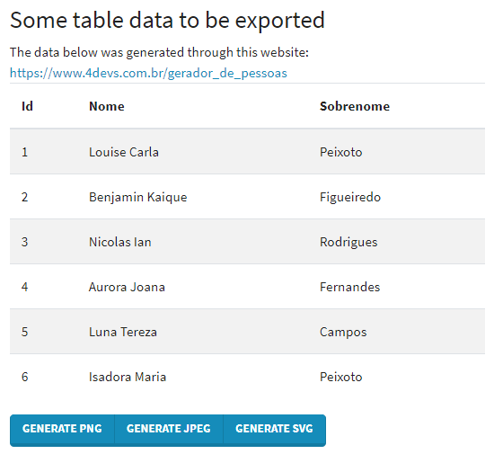

# react-dom-to-img-poc

Simple proof of concept that exports images out of html elements. This poc was built
with [react](https://github.com/facebook/react) and [html-to-image](https://github.com/bubkoo/html-to-image).

## startup

Steps to startup:

- `git clone https://github.com/pedroviniv/react-dom-to-img-poc.git`
- `cd react-dom-to-img-poc`
- `npm install`
- `npm start`

## Examples

export panel. The table will be exported

examples of images exported in **png** and **svg**

